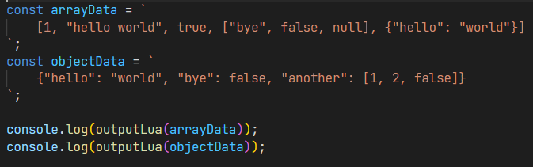
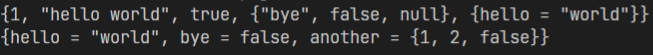

# json-to-lua
Convert a JSON string to a Lua table.  
  

## How it works
First, it generates an [abstract syntax tree](https://github.com/vtrushin/json-to-ast) from the JSON string.
  
Second, it uses recursive functions to go through all the elements in the tree. It then formats the element object to how it would appear in a Lua table, and then adds it to an array with all other formatted elements.
  
Third, it joins all the formatted elements together with commas and wraps it in curly braces.
